# Visual Slam 视觉SLAM 

> Author: Zhen Tan (MagicTZ)
>Version: 0.0.1

---

## 项目描述 (Description)

该项目基于深蓝学院视觉slam课程以及[高博的视觉Slam14讲](https://github.com/gaoxiang12/slambook2)的课后作业, 不仅对其中重要的公式进行了详细的推导, 如罗德里格斯公式, 四元数的运算性质验证, 李群与李代数的性质和运算等, 并且编程分别单独实现了SLAM系统的各个关键组成部分, 最后目的是将各个组件组合起来, 实现一个完整的SLAM系统.

---

## 内容列表 (Content of table)

- [ch1 -  ORB2-SLAM试跑](https://github.com/MagicTZ/Visual-Slam-Algorithms/tree/master/ch1)

- [ch2 - 几何运算练习(Eigen, Sophus, Quaternion)](https://github.com/MagicTZ/Visual-Slam-Algorithms/tree/master/ch2)

- [ch3 - 利用Pangolin画点云轨迹](https://github.com/MagicTZ/Visual-Slam-Algorithms/tree/master/ch3)

- [ch4 - 相机模型与非线性优化](https://github.com/MagicTZ/Visual-Slam-Algorithms/tree/master/ch4)

- [ch5 - VO (FrontEnd): ORB特征点法](https://github.com/MagicTZ/Visual-Slam-Algorithms/tree/master/ch5)

- [ch6 - VO (FrontEnd): LK光流法与RGB-D直接法](https://github.com/MagicTZ/Visual-Slam-Algorithms/tree/master/ch6)

- [ch7 - Optimization (BackEnd): g2oBA与直接法BA](https://github.com/MagicTZ/Visual-Slam-Algorithms/tree/master/ch7)

- [ch8 - LoopClosure: 预计11.15之前完成](https://github.com/MagicTZ/Visual-Slam-Algorithms/tree/master/ch8)

- [ch9 - 完整的SLAM系统构建: 预计11.22之前完成](https://github.com/MagicTZ/Visual-Slam-Algorithms/tree/master/ch9)

---

## 安装 (Install)

具体的安装步骤分别放在各个章节的文件夹的README.md中, 请自行查看安装

---

## 事例 (Examples)

事例分别展现了在不同章节实现的结果, [具体代码](#内容列表-content-of-table)请进入各章节文件夹进行查看.

- [相机畸变矫正 (矫正前后)](https://github.com/MagicTZ/Visual-Slam-Algorithms/tree/master/ch4-disparity%2Ccamera_model%2CGN/src/undistorted)

 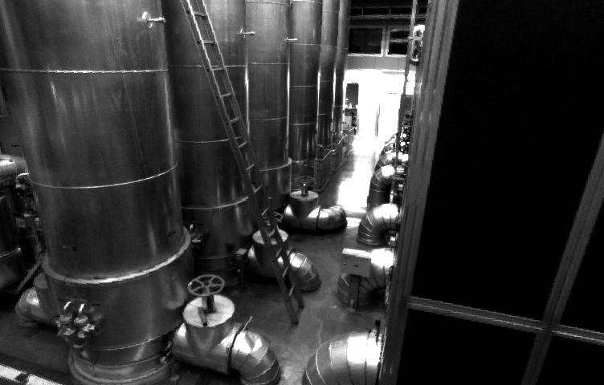

- [双目视觉计算深度 (生成的三维图在pcl-viewer中显示)](https://github.com/MagicTZ/Visual-Slam-Algorithms/tree/master/ch4-disparity%2Ccamera_model%2CGN/src/disparity)

   

 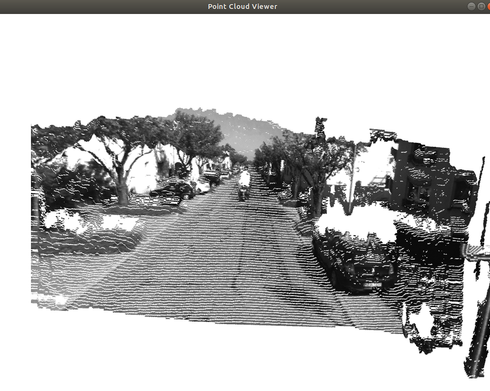

- 用ICP实现轨迹对齐

  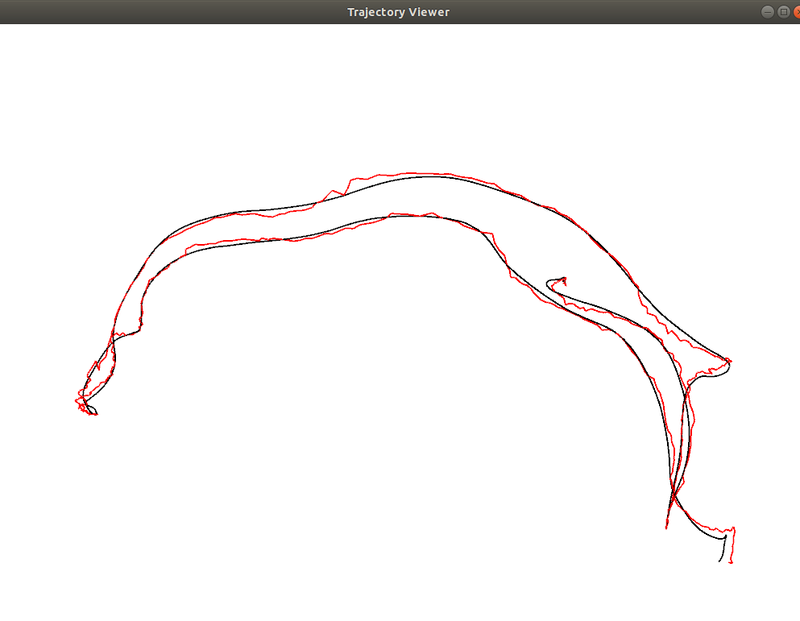 

- ORB算法结果图

     
Fast特征点提取以及ORB描述子

 

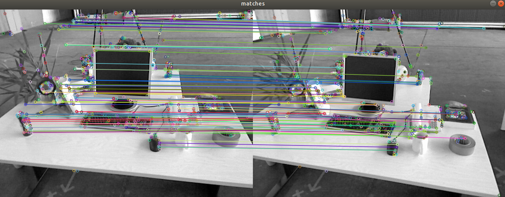
匹配结果图

 

- LK 光流法跟踪 (前向金字塔-反向金字塔)

 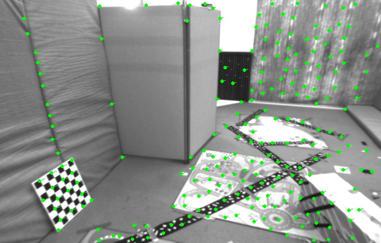

- 直接法跟踪(多层金字塔)

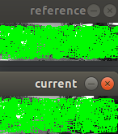 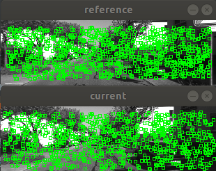 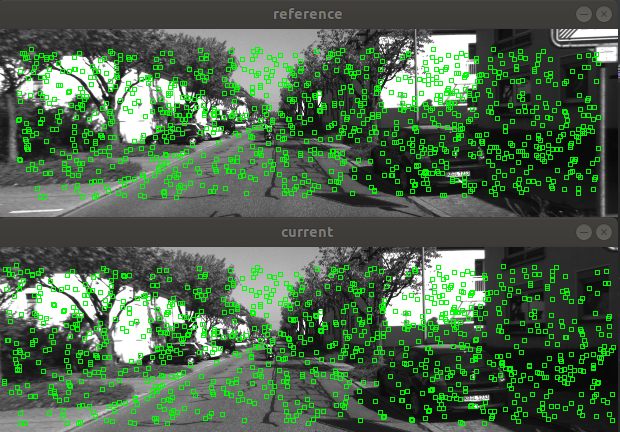 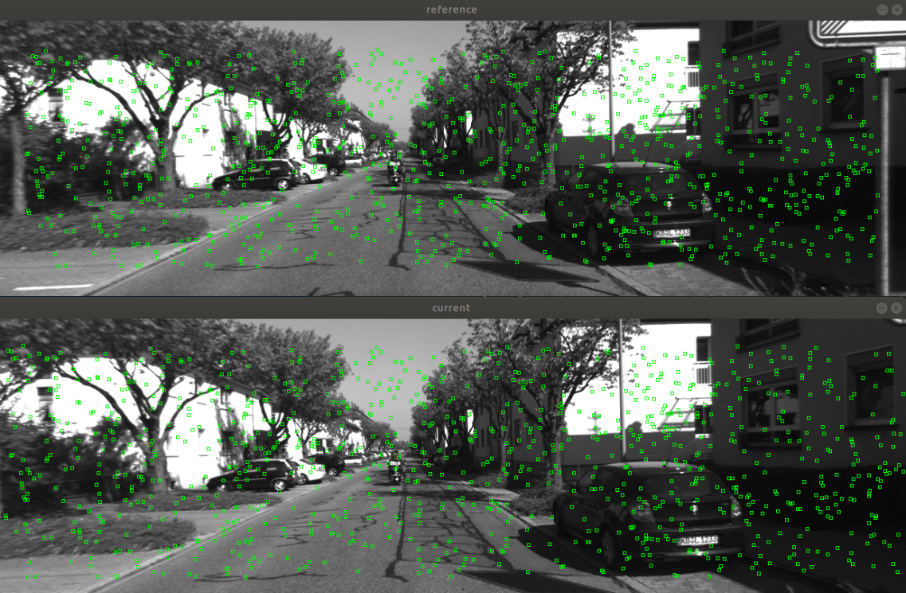 

- 后端优化(BA)

 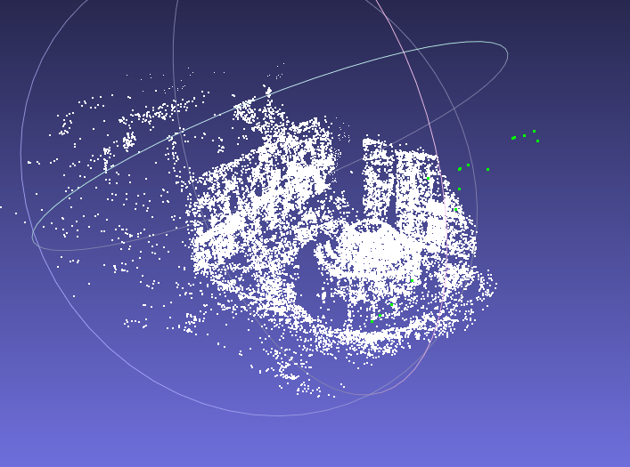

g2oBA(基于BAL, 即Bundle Adjustment in large数据集)

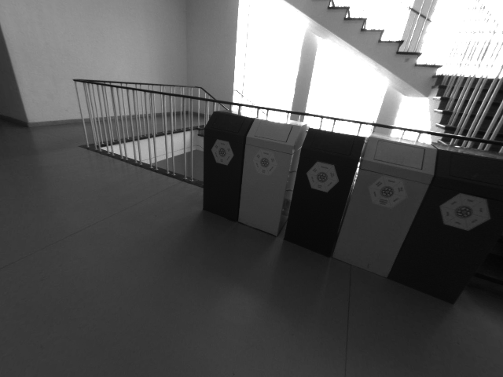 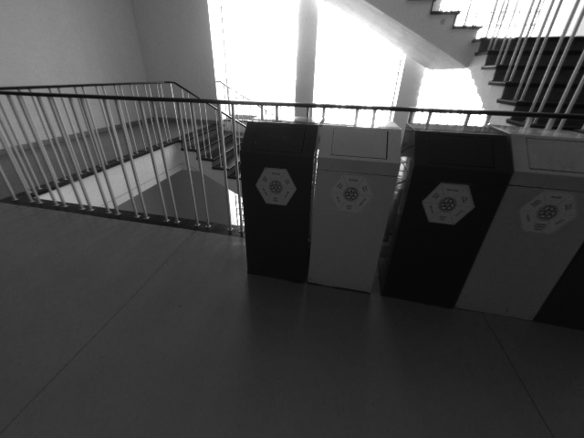 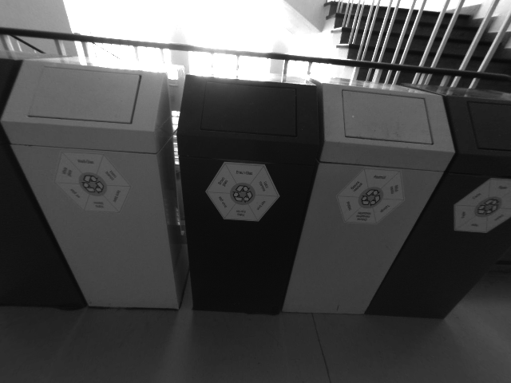 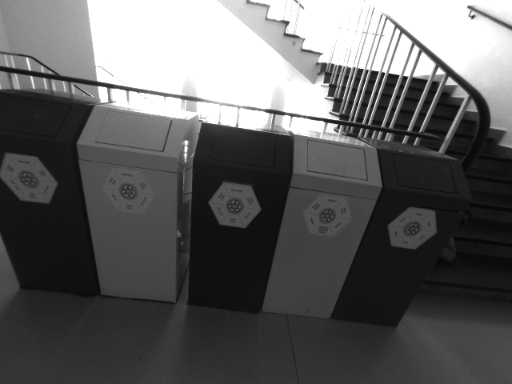
  

直接法BA(给定相机位姿文件以及三维点坐标和周围16个小块的灰度值)

---
## 维护者
[@MagicTZ](https://github.com/MagicTZ)